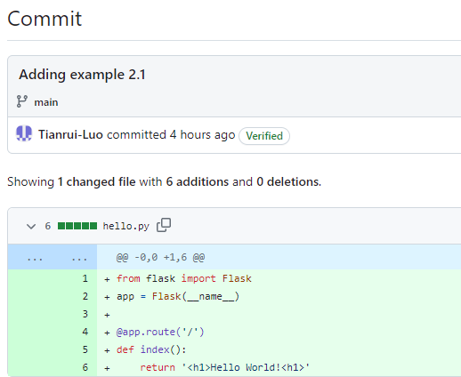
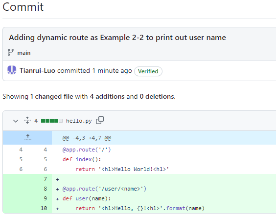
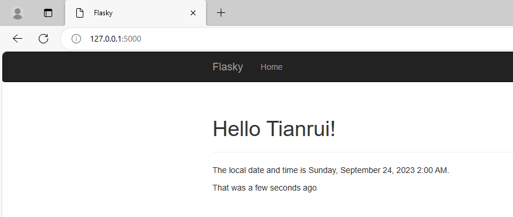
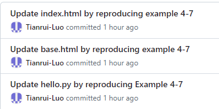
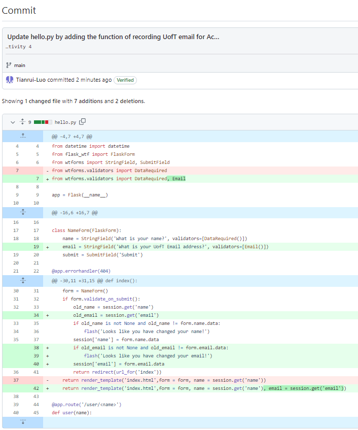
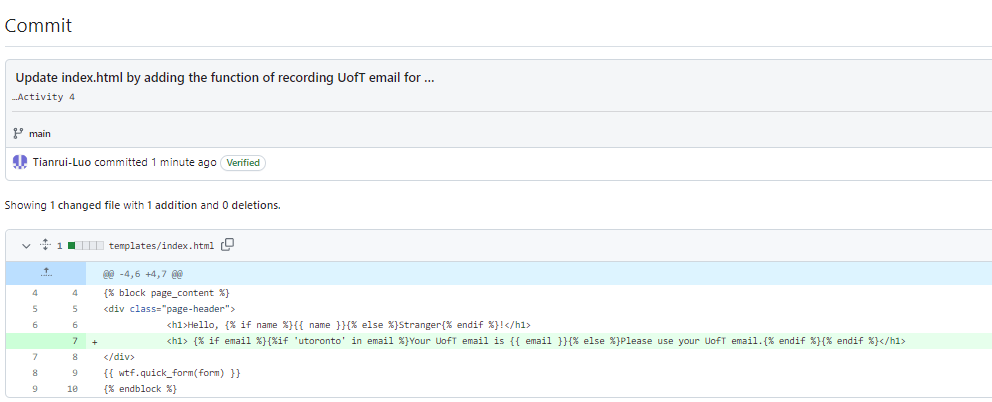
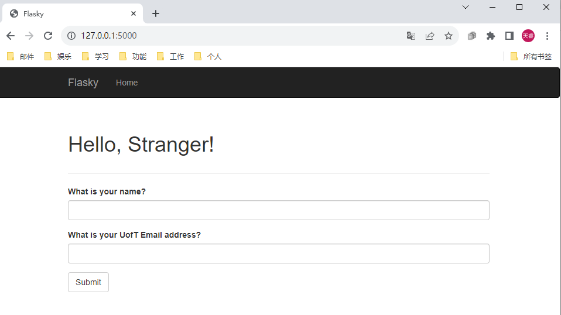
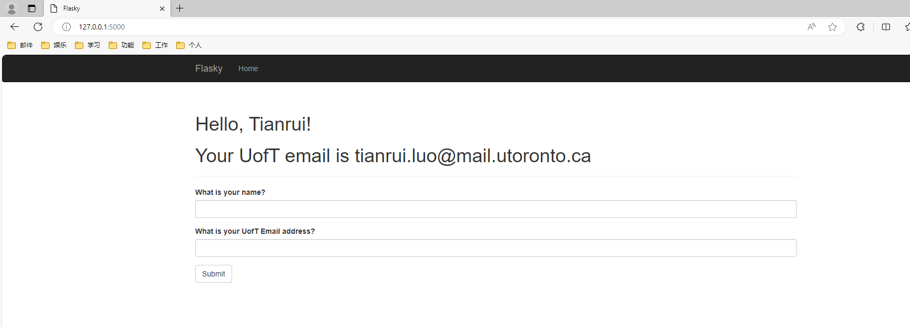
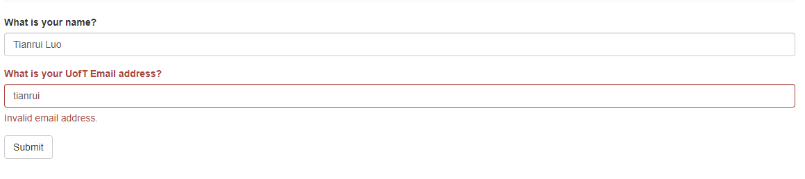
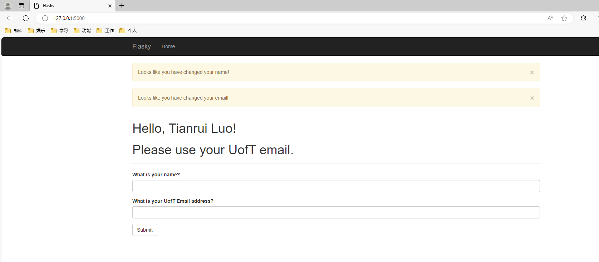

# ECE444-F2023-Lab1

Tianrui Luo

This repo is a clone of  https://github.com/miguelgrinberg/flasky

* Activity 1

* Activity 2
  
  Reproducing example 2-1
  

  Reproducing example 2-2, with my name on the webpage
  

Screenshot of 1st commit of reproducing example 2-1 to set up the webpage

Screenshot of 1st commit of reproducing example 2-2 to add dynamic route to print user name

* Activity 3

Adding Navigation bar, Title and Time display system

Screenshot of commit of updating hello.py 

* Activity 4

Reproducing example 4-7 and screenshot of commiting those changes

Adding the function of recording UofT email for Activity 4

Screenshot of commit updating hello.py

Screenshot of commit updating index.html

Screenshot of inital webpage

Screenshot of entering my first name and UofT email

Screenshot of entering my full name and first name in email panel

Screenshot of entering my full name and non-UofT email

